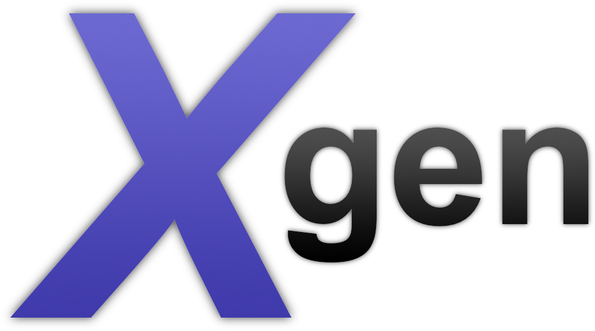

<p align="center">
    
</p>

Easily generate Xcode workspaces & playgrounds from a Swift script or command line tool.

## Usage

Generate workspaces:

```swift
import Xgen

let workspace = Workspace(path: "~/MyWorkspace")
workspace.addProject(at: "~/MyProject.xcodeproj")
try workspace.generate()
```

Generate playgrounds:

```swift
import Xgen

let code = "import Foundation\n\n" +
           "print(\"Hello world\")"
let playground = Playground(path: "~/MyPlayground", platform: .iOS, code: code)
try playground.generate()
```

## Installation

### For scripts

- Install [Marathon](https://github.com/johnsundell/marathon).
- Add Xgen to Marathon using `$ marathon add git@github.com:JohnSundell/Xgen.git`.
- Alternatively, add `git@github.com:JohnSundell/Xgen.git` to your `Marathonfile`.
- Write your script, then run it using `$ marathon run yourScript.swift`.

### For command line tools

- Add `.Package(url: "git@github.com:johnsundell/xgen.git", majorVersion: 1)` to your `Package.swift` file.
- Update your packages using `$ swift package update`.

## Help, feedback or suggestions?

- [Open an issue](https://github.com/JohnSundell/Xgen/issues/new) if you need help, if you found a bug, or if you want to discuss a feature request.
- [Open a PR](https://github.com/JohnSundell/Xgen/pull/new/master) if you want to make some change to Xgen.
- Contact [@johnsundell on Twitter](https://twitter.com/johnsundell) for discussions, news & announcements about Xgen & other projects.
